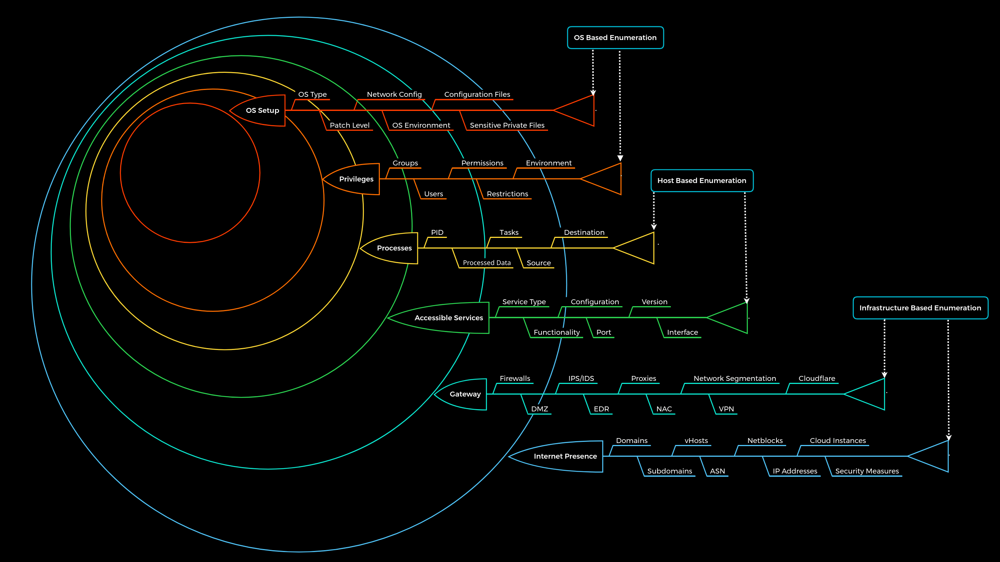
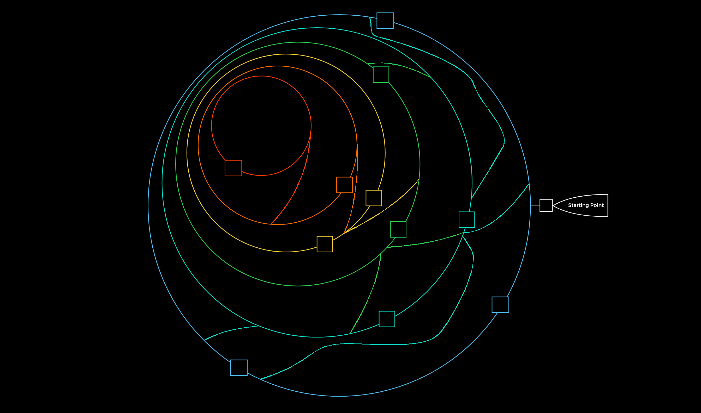
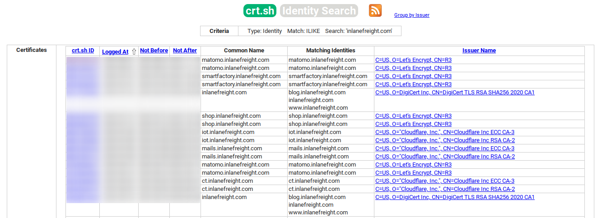
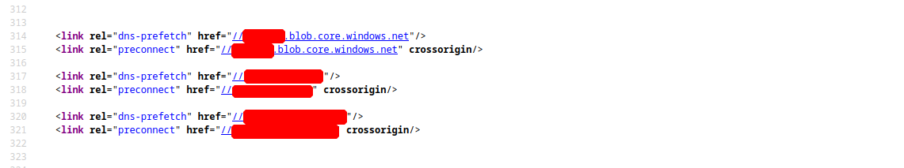
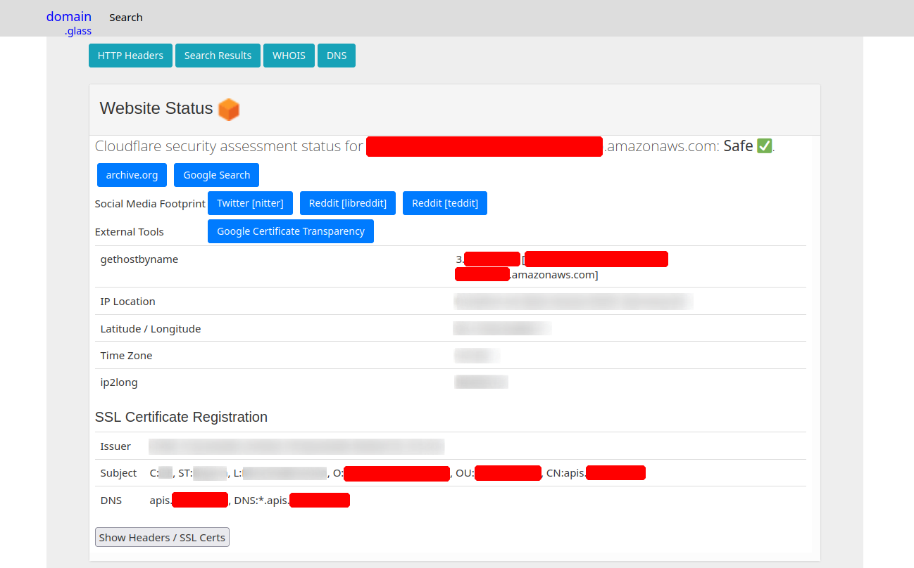
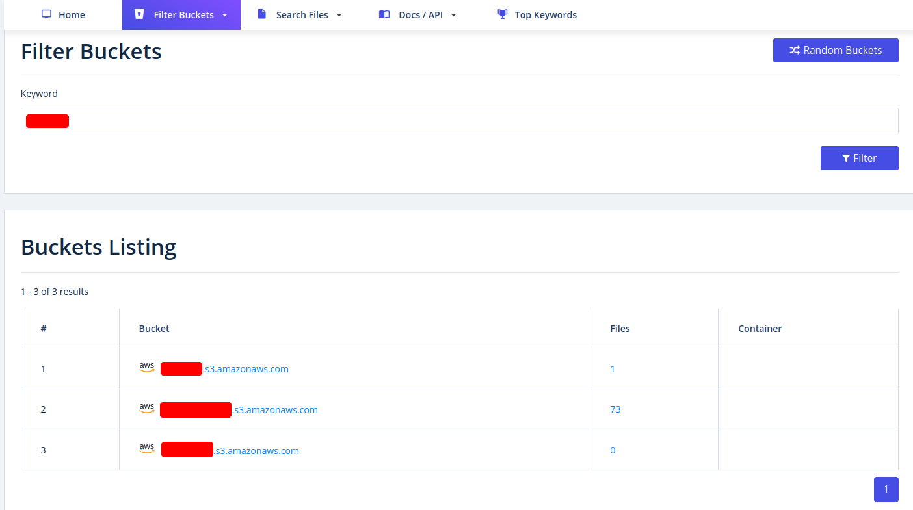
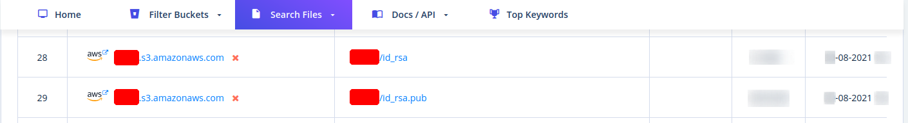

# A little Introduction : 

## what is Enumeration ?

It stands for information gathering using Active&Passive scan methods.

>Note: As penetration testers, our goal is not just to find a single entry point, but to identify every possible path an attacker could take to gain unauthorized access to the system. For example initial entry points, escalation techniques, and post exploitation activities.

### Questions to Answer

1. What can we see ? 
2. What reasons can we have for seeing it ? 
3. what impression does the observed information give us?
4. What do we gain from it ?
5. How can we use it ?
6. What can we not see ?
7. What reasons can there be that we do not see ?
9. What image results for us from what we do not see ?

### Principles you should consider

|   | Principle |
|---|---|
| 1 | There is more than meets the eye. Consider all points of view|
| 2 | Distinguish between what we see and what we don't see|
| 3 | There are always ways to gain more information. Understand the Target|

---

# Enumeration Methodology :

> Complex processes must have a standardized methodology that helps us keep our bearings and avoid overlooking any aspect.

Most penetration testers rely on personal habits and the steps they are most familiar with. This approach is based on experience rather than a standardized methodology.



> Note: The components of each layer shown represent the main categories and not a full list of all the components to search for. Additionally, it must be mentioned here that the first and second layer (Internet Presence, Gateway) does not quite apply to the intranet, such as an Active Directory infrastructure. The layers for internal infrastructure will be covered in other modules.


### The whole enumeration process is divided into three different levels :

- Infrastructure-based enumeration	
- Host-based enumeration	
- OS-based enumeration

## Enumeration Layers

| Layer   | Name                 | Description                                                                     | Information Categories                                                                     |
|---------|----------------------|---------------------------------------------------------------------------------|--------------------------------------------------------------------------------------------|
| 1       | 🌐 Internet Presence | Identification of internet presence and externally accessible infrastructure    | Domains, Subdomains, vHosts, ASN, Netblocks, IPs, Cloud Instances, Security Measures       |
| 2       | 🛡️ Gateway           | Identify security measures protecting external and internal infrastructure      | Firewalls, DMZ, IPS/IDS, EDR, Proxies, NAC, Segmentation, VPN, Cloudflare                  |
| 3       | 🔌 Services          | Identify externally and internally accessible services and interfaces           | Service Type, Functionality, Configuration, Port, Version, Interface                       |
| 4       | ⚙️ Processes         | Identify internal processes, data flow, and communication paths                 | PID, Processed Data, Tasks, Source, Destination                                            |
| 5       | 🔑 Privileges        | Identify permissions and privilege levels across services                       | Groups, Users, Permissions, Restrictions, Environment                                      |
| 6       | 🖥️ OS Setup          | Identify system components and operating system configuration                   | OS Type, Patch Level, Network Config, Environment, Config Files, Sensitive Files           |

<br>

#### ***🌐 Layer No.1: Internet Presence***

<p>The first layer we have to pass is the "Internet Presence" layer, where we focus on finding the targets we can investigate. If the scope in the contract allows us to look for additional hosts, this layer is even more critical than for fixed targets only. In this layer, we use different techniques to find domains, subdomains, netblocks, and many other components and information that present the presence of the company and its infrastructure on the Internet.</p>

```The goal of this layer is to identify all possible target systems and interfaces that can be tested.```

#### ***🛡️ Layer No.2: Gateway***

<p>Here we try to understand the interface of the reachable target, how it is protected, and where it is located in the network. Due to the diversity, different functionalities, and some particular procedures, we will go into more detail about this layer in other modules.</p>

```The goal is to understand what we are dealing with and what we have to watch out for.```

#### ***🔌 Layer No.3: Accessible Services***

<p>In the case of accessible services, we examine each destination for all the services it offers. Each of these services has a specific purpose that has been installed for a particular reason by the administrator. Each service has specific functions that produce distinct outcomes. To work effectively with them, we need to know how they work. Otherwise, we need to learn to understand them.</p>

```This layer aims to understand the reason and functionality of the target system and gain the necessary knowledge to communicate with it and exploit it for our purposes effectively.```


#### ***⚙️ Layer No.4: Processes***

<p>Every time a command or function is executed, data is processed, whether entered by the user or generated by the system. This starts a process that has to perform specific tasks, and such tasks have at least one source and one target.</p>

```The goal here is to understand these factors and identify the dependencies between them.```

#### ***🔑 Layer No.5: Privileges***

<p>Each service runs through a specific user in a particular group with permissions and privileges defined by the administrator or the system. These privileges often provide us with functions that administrators overlook. This often happens in Active Directory infrastructures and many other case-specific administration environments and servers where users are responsible for multiple administration areas.</p>

```It is crucial to identify these and understand what is and is not possible with these privileges.```

#### ***🖥️ Layer No.6: OS Setup***

<p>Here we collect information about the actual operating system and its setup using internal access. This gives us a good overview of the internal security of the systems and reflects the skills and capabilities of the company's administrative teams.</p>

```The goal here is to see how the administrators manage the systems and what sensitive internal information we can glean from them.```


<br>

#### Enumeration Methodology in Practice
- We can finally imagine the entire penetration test in the form of a labyrinth where we have to identify the gaps and find the way to get us inside as quickly and effectively as possible. This type of labyrinth may look something like this:
> NOTE: The squares represent the gaps/vulnerabilities.



<br>


# Infrastructure Based Enumeration
<br>

## Domain Information
Domain information it is not just about the subdomains but about the entire presence on the Internet. Therefore, we gather information and try to understand the company's functionality and which technologies and structures are necessary for services to be offered successfully and efficiently. ***This type of information is gathered passively without direct and active scans.***

the first thing we should do is scrutinize the company's main website. Then, we should read through the texts, keeping in mind what technologies and structures are needed for these services.

### Online Presence
Once we have a basic understanding of the company and its services, we can get a first impression of its presence on the Internet.

1. The first point of presence on the Internet may be the SSL certificate from the company's main website that we can examine. Often, such a certificate includes more than just a subdomain, and this means that the certificate is used for several domains, and these are most likely still active.

2. Another source to find more subdomains is crt.sh. This source is Certificate Transparency logs. 

#### What is a Certificate Transparency logs ?

 **It's a process that is intended to enable the verification of issued digital certificates for encrypted Internet connections.** <br>The standard (RFC 6962) provides for the logging of all digital certificates issued by a certificate authority in audit-proof logs.<br> 
 This is intended to enable the detection of false or maliciously issued certificates for a domain. SSL certificate providers like Let's Encrypt share this with the web interface crt.sh, which stores the new entries in the database to be accessed later.
 

 <br>

-  We can also output the results in JSON format.

```
curl -s https://crt.sh/\?q\=inlanefreight.com\&output\=json | jq .

[
  {
    "issuer_ca_id": 23451835427,
    "issuer_name": "C=US, O=Let's Encrypt, CN=R3",
    "common_name": "matomo.inlanefreight.com",
    "name_value": "matomo.inlanefreight.com",
    "id": 50815783237226155,
    "entry_timestamp": "2021-08-21T06:00:17.173",
    "not_before": "2021-08-21T05:00:16",
    "not_after": "2021-11-19T05:00:15",
    "serial_number": "03abe9017d6de5eda90"
  },
  {
    "issuer_ca_id": 6864563267,
    "issuer_name": "C=US, O=Let's Encrypt, CN=R3",
    "common_name": "matomo.inlanefreight.com",
    "name_value": "matomo.inlanefreight.com",
    "id": 5081529377,
    "entry_timestamp": "2021-08-21T06:00:16.932",
    "not_before": "2021-08-21T05:00:16",
    "not_after": "2021-11-19T05:00:15",
    "serial_number": "03abe90104e271c98a90"
  },
  {
    "issuer_ca_id": 113123452,
    "issuer_name": "C=US, O=Let's Encrypt, CN=R3",
    "common_name": "smartfactory.inlanefreight.com",
    "name_value": "smartfactory.inlanefreight.com",
    "id": 4941235512141012357,
    "entry_timestamp": "2021-07-27T00:32:48.071",
    "not_before": "2021-07-26T23:32:47",
    "not_after": "2021-10-24T23:32:45",
    "serial_number": "044bac5fcc4d59329ecbbe9043dd9d5d0878"
  },
  { ... SNIP ...
  ```

  <br>

  - If needed, we can also have them filtered by the unique subdomains.
  ```
  curl -s https://crt.sh/\?q\=inlanefreight.com\&output\=json | jq . | grep name | cut -d":" -f2 | grep -v "CN=" | cut -d'"' -f2 | awk '{gsub(/\\n/,"\n");}1;' | sort -u

account.ttn.inlanefreight.com
blog.inlanefreight.com
bots.inlanefreight.com
console.ttn.inlanefreight.com
ct.inlanefreight.com
data.ttn.inlanefreight.com
*.inlanefreight.com
inlanefreight.com
integrations.ttn.inlanefreight.com
iot.inlanefreight.com
mails.inlanefreight.com
marina.inlanefreight.com
marina-live.inlanefreight.com
matomo.inlanefreight.com
next.inlanefreight.com
noc.ttn.inlanefreight.com
preview.inlanefreight.com
shop.inlanefreight.com
smartfactory.inlanefreight.com
ttn.inlanefreight.com
vx.inlanefreight.com
www.inlanefreight.com
  ```

<br>

- we can identify the hosts directly accessible from the Internet and not hosted by third-party providers.

```
for i in $(cat subdomainlist);do host $i | grep "has address" | grep inlanefreight.com | cut -d" " -f1,4;done

blog.inlanefreight.com 10.129.24.93
inlanefreight.com 10.129.27.33
matomo.inlanefreight.com 10.129.127.22
www.inlanefreight.com 10.129.127.33
s3-website-us-west-2.amazonaws.com 10.129.95.250
```

<br>

Once we see which hosts can be investigated further, we can generate a list of IP addresses with a minor adjustment to the cut command and run them through Shodan.

> You can skip this if you want
>>Shodan can be used to find devices and systems permanently connected to the Internet like Internet of Things (IoT).<br> It searches the Internet for open TCP/IP ports and filters the systems according to specific terms and criteria. <br> For example, open HTTP or HTTPS ports and other server ports for FTP, SSH, SNMP, Telnet, RTSP, or SIP are searched. <br> As a result, we can find devices and systems, such as surveillance cameras, servers, smart home systems, industrial controllers, traffic lights and traffic >>controllers, and various network components.

<br>

- Shodan - IP List

1.IP Extraction
```
for i in $(cat subdomainlist);do host $i | grep "has address" | grep inlanefreight.com | cut -d" " -f4 >> ip-addresses.txt;done
```
2.Enumeration using Shodan
```
for i in $(cat ip-addresses.txt);do shodan host $i;done

10.129.24.93
City:                    Berlin
Country:                 Germany
Organization:            InlaneFreight
Updated:                 2021-09-01T09:02:11.370085
Number of open ports:    2

Ports:
     80/tcp nginx 
    443/tcp nginx 
    
10.129.27.33
City:                    Berlin
Country:                 Germany
Organization:            InlaneFreight
Updated:                 2021-08-30T22:25:31.572717
Number of open ports:    3

Ports:
     22/tcp OpenSSH (7.6p1 Ubuntu-4ubuntu0.3)
     80/tcp nginx 
    443/tcp nginx 
        |-- SSL Versions: -SSLv2, -SSLv3, -TLSv1, -TLSv1.1, -TLSv1.3, TLSv1.2
        |-- Diffie-Hellman Parameters:
                Bits:          2048
                Generator:     2
                
10.129.27.22
City:                    Berlin
Country:                 Germany
Organization:            InlaneFreight
Updated:                 2021-09-01T15:39:55.446281
Number of open ports:    8

Ports:
     25/tcp  
        |-- SSL Versions: -SSLv2, -SSLv3, -TLSv1, -TLSv1.1, TLSv1.2, TLSv1.3
     53/tcp  
     53/udp  
     80/tcp Apache httpd 
     81/tcp Apache httpd 
    110/tcp  
        |-- SSL Versions: -SSLv2, -SSLv3, -TLSv1, -TLSv1.1, TLSv1.2
    111/tcp  
    443/tcp Apache httpd 
        |-- SSL Versions: -SSLv2, -SSLv3, -TLSv1, -TLSv1.1, TLSv1.2, TLSv1.3
        |-- Diffie-Hellman Parameters:
                Bits:          2048
                Generator:     2
                Fingerprint:   RFC3526/Oakley Group 14
    444/tcp  
        
10.129.27.33
City:                    Berlin
Country:                 Germany
Organization:            InlaneFreight
Updated:                 2021-08-30T22:25:31.572717
Number of open ports:    3

Ports:
     22/tcp OpenSSH (7.6p1 Ubuntu-4ubuntu0.3)
     80/tcp nginx 
    443/tcp nginx 
        |-- SSL Versions: -SSLv2, -SSLv3, -TLSv1, -TLSv1.1, -TLSv1.3, TLSv1.2
        |-- Diffie-Hellman Parameters:
                Bits:          2048
                Generator:     2
```
<br>

- we can display all the available DNS records where we might find more hosts.
```
dig any inlanefreight.com

; <<>> DiG 9.16.1-Ubuntu <<>> any inlanefreight.com
;; global options: +cmd
;; Got answer:
;; ->>HEADER<<- opcode: QUERY, status: NOERROR, id: 52058
;; flags: qr rd ra; QUERY: 1, ANSWER: 17, AUTHORITY: 0, ADDITIONAL: 1

;; OPT PSEUDOSECTION:
; EDNS: version: 0, flags:; udp: 65494
;; QUESTION SECTION:
;inlanefreight.com.             IN      ANY

;; ANSWER SECTION:
inlanefreight.com.      300     IN      A       10.129.27.33
inlanefreight.com.      300     IN      A       10.129.95.250
inlanefreight.com.      3600    IN      MX      1 aspmx.l.google.com.
inlanefreight.com.      3600    IN      MX      10 aspmx2.googlemail.com.
inlanefreight.com.      3600    IN      MX      10 aspmx3.googlemail.com.
inlanefreight.com.      3600    IN      MX      5 alt1.aspmx.l.google.com.
inlanefreight.com.      3600    IN      MX      5 alt2.aspmx.l.google.com.
inlanefreight.com.      21600   IN      NS      ns.inwx.net.
inlanefreight.com.      21600   IN      NS      ns2.inwx.net.
inlanefreight.com.      21600   IN      NS      ns3.inwx.eu.
inlanefreight.com.      3600    IN      TXT     "MS=ms92346782372"
inlanefreight.com.      21600   IN      TXT     "atlassian-domain-verification=IJdXMt1rKCy68JFszSdCKVpwPN"
inlanefreight.com.      3600    IN      TXT     "google-site-verification=O7zV5-xFh_jn7JQ31"
inlanefreight.com.      300     IN      TXT     "google-site-verification=bow47-er9LdgoUeah"
inlanefreight.com.      3600    IN      TXT     "google-site-verification=gZsCG-BINLopf4hr2"
inlanefreight.com.      3600    IN      TXT     "logmein-verification-code=87123gff5a479e-61d4325gddkbvc1-b2bnfghfsed1-3c789427sdjirew63fc"
inlanefreight.com.      300     IN      TXT     "v=spf1 include:mailgun.org include:_spf.google.com include:spf.protection.outlook.com include:_spf.atlassian.net ip4:10.129.24.8 ip4:10.129.27.2 ip4:10.72.82.106 ~all"
inlanefreight.com.      21600   IN      SOA     ns.inwx.net. hostmaster.inwx.net. 2021072600 10800 3600 604800 3600

;; Query time: 332 msec
;; SERVER: 127.0.0.53#53(127.0.0.53)
;; WHEN: Mi Sep 01 18:27:22 CEST 2021
;; MSG SIZE  rcvd: 940
```

- DNS (Domain Name System) records

  - A records: We recognize the IP addresses that point to a specific (sub)domain through the A record. Here we only see one that we already know.
  - MX records: The mail server records show us which mail server is responsible for managing the emails for the company. Since this is handled by google in our case, we should note this and skip it for now.
  - NS records: These kinds of records show which name servers are used to resolve the FQDN to IP addresses. Most hosting providers use their own name servers, making it easier to identify the hosting provider.
  - TXT records: this type of record often contains verification keys for different third-party providers and other security aspects of DNS, such as SPF, DMARC, and DKIM, which are responsible for verifying and confirming the origin of the emails sent. Here we can already see some valuable information if we look closer at the results.


<br>

# Cloud Resources

The use of cloud, such as AWS, GCP, Azure, and others, is now one of the essential components for many companies nowadays. After all, all companies want to be able to do their work from anywhere, so they need a central point for all management. This is why services from Amazon (AWS), Google (GCP), and Microsoft (Azure) are ideal for this purpose.

Even though cloud providers secure their infrastructure centrally, this does not mean that companies are free from vulnerabilities. The configurations made by the administrators may nevertheless make the company's cloud resources vulnerable. This often starts with the S3 buckets (AWS), blobs (Azure), cloud storage (GCP), which can be accessed without authentication if configured incorrectly.

```
for i in $(cat subdomainlist);do host $i | grep "has address" | grep inlanefreight.com | cut -d" " -f1,4;done

blog.inlanefreight.com 10.129.24.93
inlanefreight.com 10.129.27.33
matomo.inlanefreight.com 10.129.127.22
www.inlanefreight.com 10.129.127.33
s3-website-us-west-2.amazonaws.com 10.129.95.250
```

<br>

Often cloud storage is added to the DNS list when used for administrative purposes by other employees. This step makes it much easier for the employees to reach and manage them. Let us stay with the case that a company has contracted us, and during the IP lookup, we have already seen that one IP address belongs to the s3-website-us-west-2.amazonaws.com server.

However, there are many different ways to find such cloud storage. One of the easiest and most used is Google search combined with Google Dorks. For example, we can use the Google Dorks inurl: and intext: to narrow our search to specific terms. In the following example, we see red censored areas containing the company name.

<br>

- Google Search for AWS
```
intext:website inurl:amazonaws.com
```

- Google Search for Azure

```
intext:website inurl:blob.core.windows.net
```

Such content is also often included in the source code of the web pages, from where the images, JavaScript codes, or CSS are loaded. This procedure often relieves the web server and does not store unnecessary content.



Third-party providers such as domain.glass can also tell us a lot about the company's infrastructure. As a positive side effect, we can also see that Cloudflare's security assessment status has been classified as "Safe". This means we have already found a security measure that can be noted for the second layer (gateway).




Another very useful provider is GrayHatWarfare. We can do many different searches, discover AWS, Azure, and GCP cloud storage, and even sort and filter by file format. Therefore, once we have found them through Google, we can also search for them on GrayHatWarefare and passively discover what files are stored on the given cloud storage.



Many companies also use abbreviations of the company name, which are then used accordingly within the IT infrastructure. Such terms are also part of an excellent approach to discovering new cloud storage from the company. We can also search for files simultaneously to see the files that can be accessed at the same time.



Sometimes when employees are overworked or under high pressure, mistakes can be fatal for the entire company. These errors can even lead to SSH private keys being leaked, which anyone can download and log onto one or even more machines in the company without using a password.


<br>

# Staff
<br>

Searching for and identifying employees on social media platforms can also reveal a lot about the teams' infrastructure and makeup. This, in turn, can lead to us identifying which technologies, programming languages, and even software applications are being used. To a large extent, we will also be able to assess each person's focus based on their skills.

Employees can be identified on various business networks such as LinkedIn or Xing. Job postings from companies can also tell us a lot about their infrastructure and give us clues about what we should be looking for.


#### LinkedIn - Job Post

```
Required Skills/Knowledge/Experience:

* 3-10+ years of experience on professional software development projects.

« An active US Government TS/SCI Security Clearance (current SSBI) or eligibility to obtain TS/SCI within nine months.
« Bachelor's degree in computer science/computer engineering with an engineering/math focus or another equivalent field of discipline.
« Experience with one or more object-oriented languages (e.g., Java, C#, C++).
« Experience with one or more scripting languages (e.g., Python, Ruby, PHP, Perl).
« Experience using SQL databases (e.g., PostgreSQL, MySQL, SQL Server, Oracle).
« Experience using ORM frameworks (e.g., SQLAIchemy, Hibernate, Entity Framework).
« Experience using Web frameworks (e.g., Flask, Django, Spring, ASP.NET MVC).
« Proficient with unit testing and test frameworks (e.g., pytest, JUnit, NUnit, xUnit).
« Service-Oriented Architecture (SOA)/microservices & RESTful API design/implementation.
« Familiar and comfortable with Agile Development Processes.
« Familiar and comfortable with Continuous Integration environments.
« Experience with version control systems (e.g., Git, SVN, Mercurial, Perforce).

Desired Skills/Knowledge/ Experience:

« CompTIA Security+ certification (or equivalent).
« Experience with Atlassian suite (Confluence, Jira, Bitbucket).
« Algorithm Development (e.g., Image Processing algorithms).
« Software security.
« Containerization and container orchestration (Docker, Kubernetes, etc.)
« Redis.
« NumPy.
```

From a job post like this, we can see, for example, which programming languages are preferred: Java, C#, C++, Python, Ruby, PHP, Perl. It also required that the applicant be familiar with different databases, such as: PostgreSQL, Mysql, and Oracle. In addition, we know that different frameworks are used for web application development, such as: Flask, Django, ASP.NET, Spring.

> You might also find sensitive information

<br>

# Host Based Enumeration
<br>
| Protocol | Link |
|------|------|
| 1  | [FTP](CPTS-PATH/Information-Gathering-Footprinting/ftp.md) |
| 2 | [SMB](CPTS-PATH/Information-Gathering-Footprinting/smb.md) |
| 3 | [NFS]() |
| 4 | [DNS]()|
| 5 | [SMTP]()|
| 6 | [IMAP / POP3]()|
| 7 | [SNMP]()|
| 8 | [MySQL]()|
| 9 | [MSSQL]()|
| 10 | [Oracle TNS]()|
| 11 | [IPMI]()|
